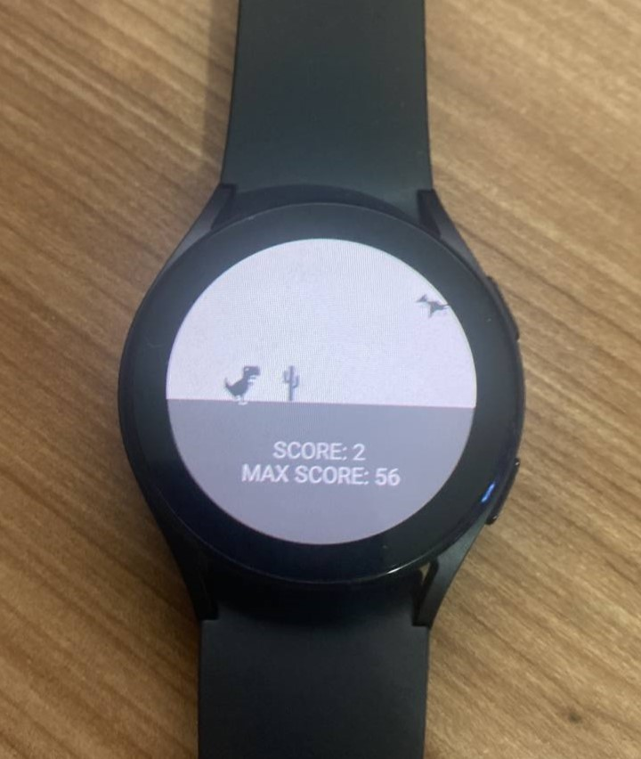
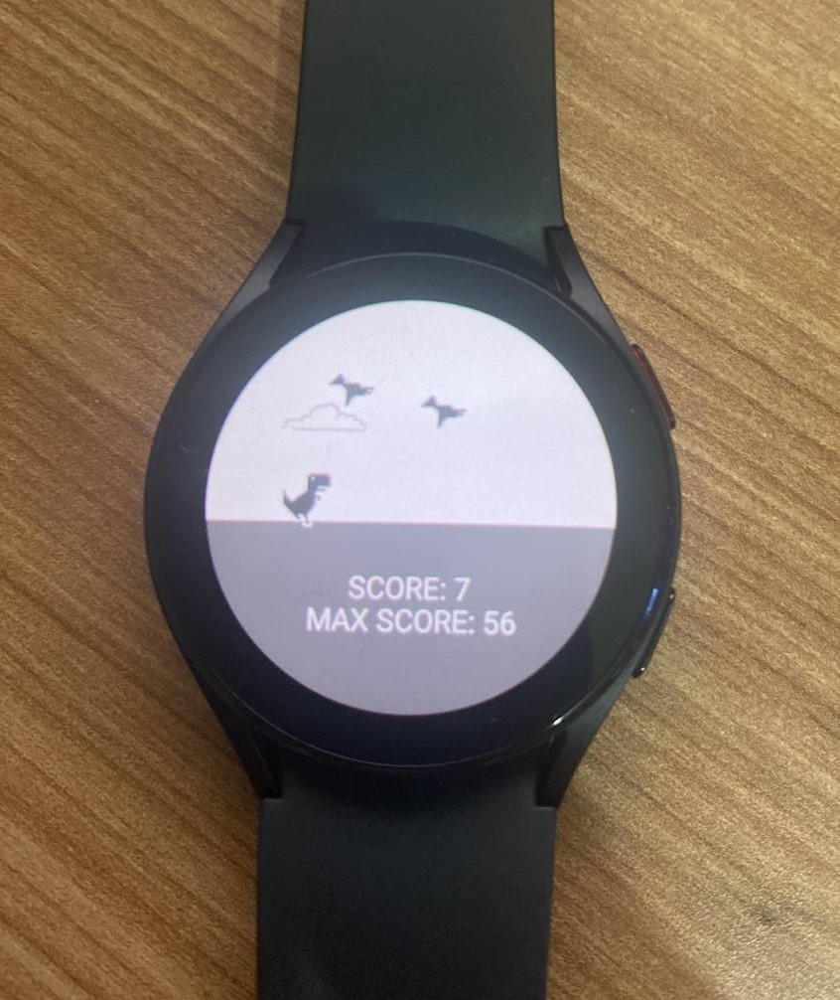

# Android App Dino Game WearOs

O Dino Game é um emocionante jogo para Wear OS que oferece uma experiência semelhante ao famoso jogo do dinossauro do Google Chrome, mas com um toque de aventura e recursos adicionais específicos para dispositivos vestíveis.

## Screenshots

## Tecnologias utilizadas

## Começando

Esta amostra usa o sistema de compilação Gradle. Para construir este projeto, use o
comando "gradlew build" ou use "Import Project" no Android Studio.

## Apoiar

- Stack Overflow: https://stackoverflow.com/questions/tagged/wear-os

Se você encontrou um erro neste exemplo, registre um problema no rastreador de problemas.

Patches são encorajados e podem ser enviados por bifurcação deste projeto e
enviando uma solicitação pull por meio do GitHub. Consulte CONTRIBUTING.md para obter mais detalhes.
